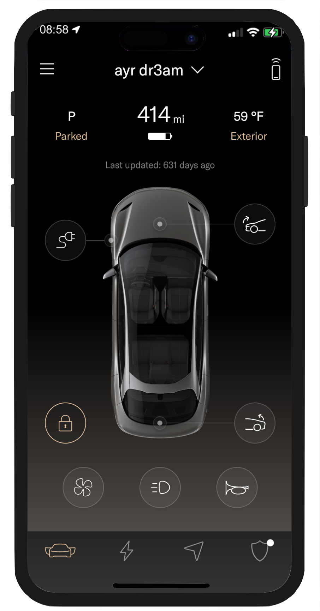
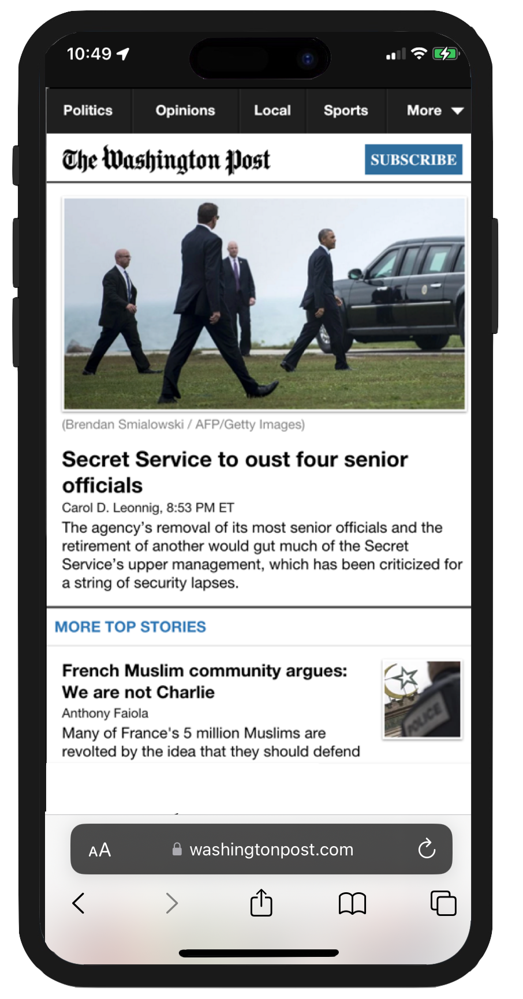
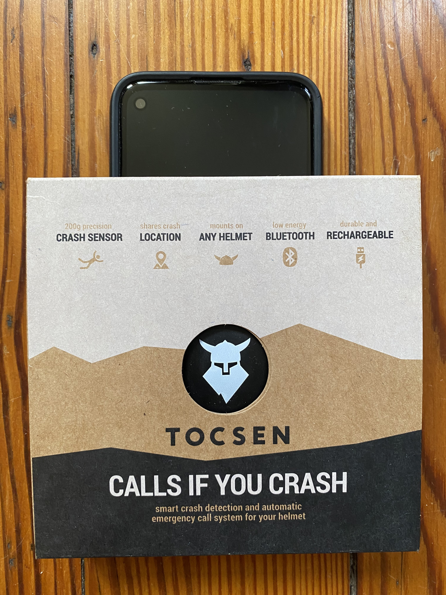
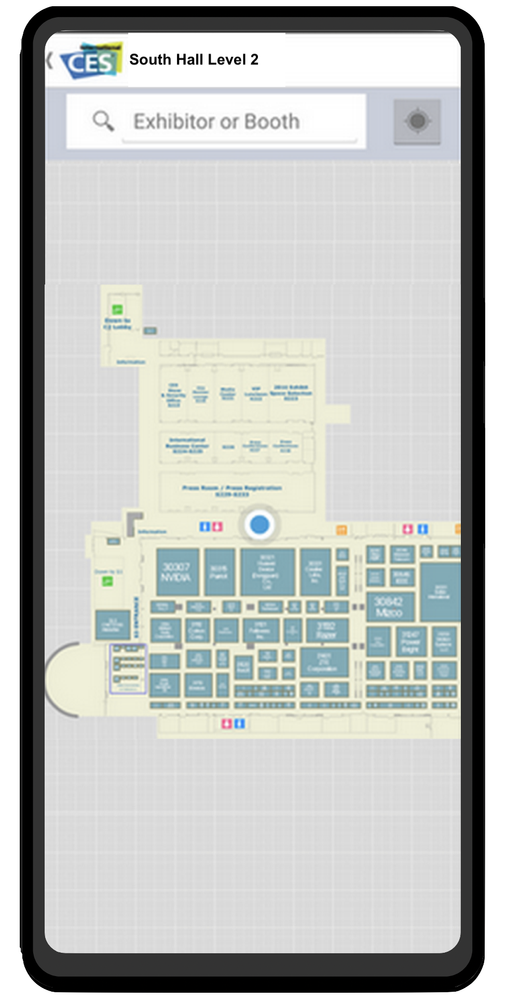
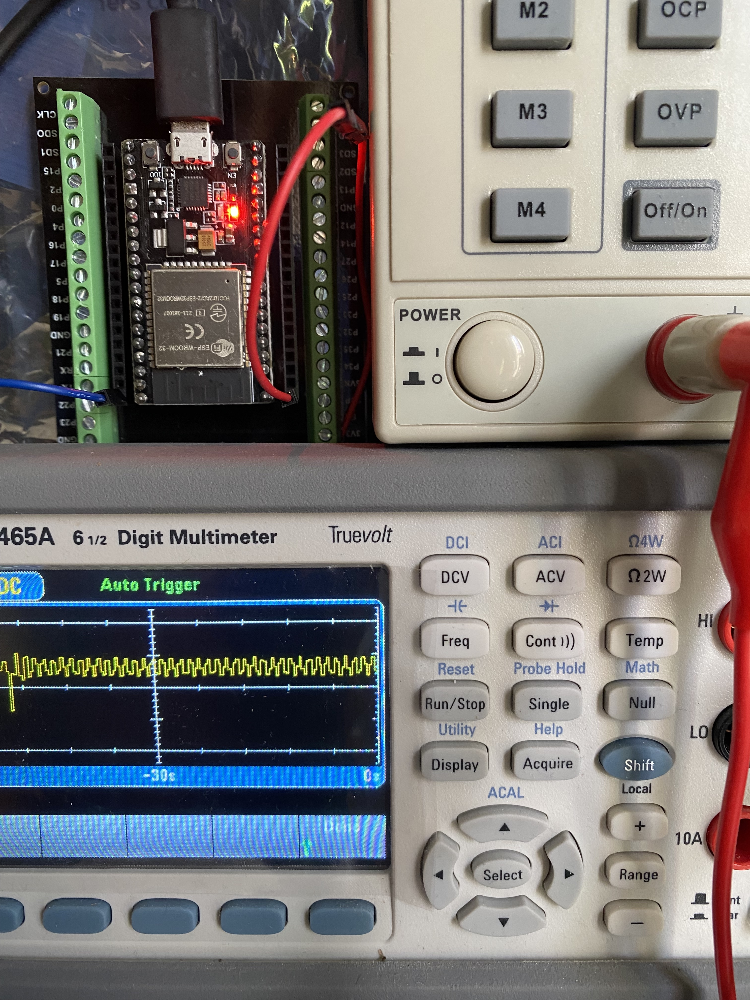
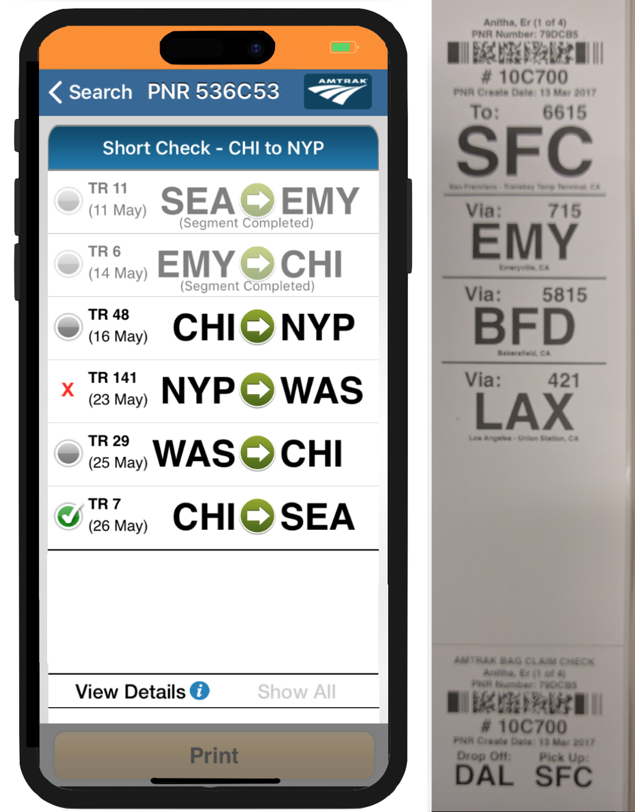
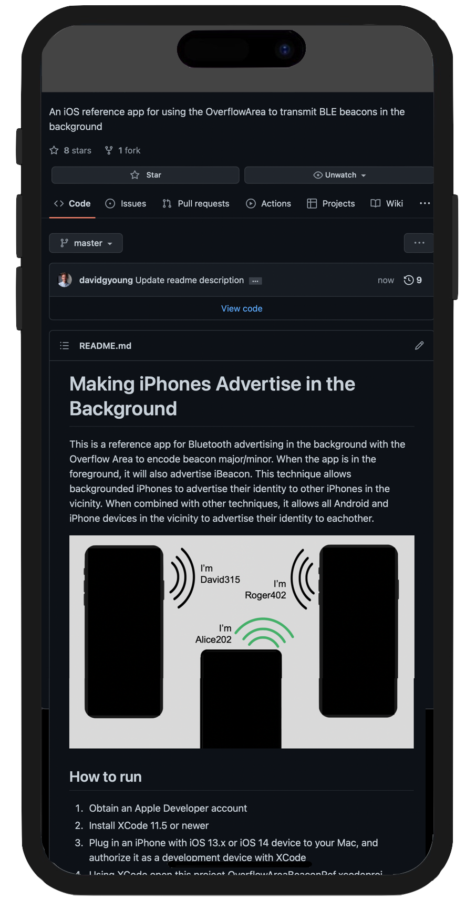
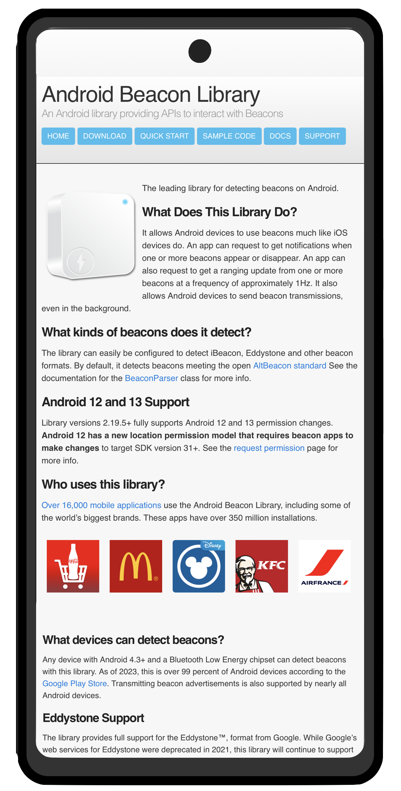


<link rel="stylesheet" type="text/css" media="screen" href="stylesheets/stylesheet.css">

<!-- HEADER -->

    <header class="inner">
      
      <h1 id="project_title">David G. Young Tech</h1>
      <h2 id="project_tagline">Contract engineering and software development</h2>
    </header>

<!-- MAIN CONTENT -->

  <section id="main_content" class="inner">
    
David is available for contract software development work for clients worldwide.  He will help complete your project on time and under budget.
    His strong interpersonal skills make for easy conversations about even the most technical subjects.  His high-energy temperament and entrepreneurial orientation requires minimal supervision.   His mobile apps and libraries run on over 150 million mobile devices worldwide, and past works are exhibited at the Smithsonian National Air and Space Museum.  References available on request.
    

<table border="0" cellpadding="4" align="right" width="320"><tbody><tr><td>
<iframe title="YouTube video player" class="youtube-player" type="text/html"
width="320" height="195" src="https://www.youtube.com/embed/d4kWG8wtzmQ"
frameborder="0" allowFullScreen></iframe>
</td></tr></tbody></table>

    <h3>Specialties</h3>
    <ul>
      <li>iOS and Android app development</li>
      <li>Embedded firmware and Internet of Things development</li>
      <li>Beacon and Bluetooth Low Energy applications</li>
      <li>RFID, NFC, and UWB applications.</li>
      <li>Alexa and voice AI applications</li>
      <li>Web service development with Node.js, Ruby, and Java</li>
    </ul>
    
    <h4>Sample Commercial Projects:</h4>
    <table class="samples">

    <tr>
    <td>
    
    
<a href='https://apps.apple.com/us/app/lucid-motors/id1579793272'>Lucid Motors Mobile Key</a>

    

iOS and Android apps
&#8226; Bluetooth LE vehicle unlock using your phone
&#8226; iOS code in Swift
&#8226; Android code in Kotlin      
    

    </td>
    <td>
    
    
<a href='http://m.washingtonpost.com'>Washington Post Mobile</a>

    

HTML 5 mobile web app
&#8226; Offline reading w/ LocalStorage
&#8226; Responsive HTML5/Javascript and jQuery frontend
&#8226; Java Spring MVC backend w/ REST web services
&#8226; Backend bundling and caching services for iPhone native app        
    

    </td>
    </tr>
    <tr>
    <td>
    
    
<a href='https://play.google.com/store/apps/details?id=com.tocsenapp&hl=en_US&gl=US'>Tocsen Crash App</a>

Bluetoth-based crash sensor
&#8226; Mobile apps for iOS and Android
&#8226; ReactNative UI and Bluetooth Native Modules
&#8226; Android Beacon Library integration

    </td>
    <td>
    
    
<a href='https://play.google.com/store/apps/details?id=com.konvurj&hl=en'>Consumer Electronics Show Mobile Maps</a>

Official indoor nav app for the Consumer Electronics Show
&#8226; iOS and Android
&#8226; Responsive HTML5/Javascript and jQuery config web app
&#8226; Ruby on Rails 4 / Postgres backend

    </td>
    </tr>
    <tr>
    <td>
    
    
GPIO Serial Multiplexer

Industrial control line conversion module
&#8226; ESP32 platform
&#8226; Converts GPIO Lines to Serial I/O
&#8226; Six inputs and six outputs

    </td>
    <td>
    
    
<a href='https://itunes.apple.com/us/app/commutyble/id1153428822?mt=8'>Commutyble</a>

Garage Reservation and Access App
&#8226; iOS and Android
&#8226; Coded in Swift, Java and React Native
&#8226; Bluetooth GATT comms with Node.js garage access point
&#8226; NFC tag reading

    </td>
    </tr>
    <tr>
    <td>
    
    
Amtrak Bag Check App (Private)

    

    Allows Amtrak conductors to check and track your bags with printed tags
    &#8226; Bar code scanning with iPhone camera
    &#8226; Bluetooth tag printer integration
    &#8226; Swift 4 and Objective C
    &#8226; AWS Lambda with Node.js and a Dynamo DB
    

    </td>
    <td>
    
    
Amtrak Alexa Train Status (Private Beta)

    

    Alexa voice app for accessing real-time Amtrak train schedules.
    &#8226; AWS Lambda with a Dynamo DB
    &#8226; Java / Maven code to drive lambda
    &#8226; Restful refresh serverless API
    

    </td>
    </tr>
    </table>

    <h4>Open Source Projects:</h4>
    <table class="samples">
    <tr>
    <td>
    
    
<a href='https://github.com/davidgyoung/OverflowAreaBeaconRef'>Overflow Area Advertising</a>

    

    Mobile app for iOS
    &#8226; Allows phones to advertise to each other in the background
    &#8226; Advanced Bluetooth Low Energy advertising 
    &#8226; Open source iOS code in Swift
    &#8226; Additional techniques allow Android communication  
    

    </td>
    <td>
    
    
<a href='http://altbeacon.github.io/android-beacon-library'>Android Beacon Library</a>

Open Source library for bluetooth beacons

    </td>
    </tr>
    </table>  
    
	<h4>Testimonials:</h4>
	<blockquote>"I enthusiastically recommend David Young for development work. 
David is an incredibly skilled developer, adept at both frontend and backend work 
in addition to overall architecture. David is at his best when presented with a 
problem to solve. He'll suggest several technical solutions and recommend the best one 
for either my budget, time or desired effect. He hits all deadlines and communicates 
clearly around when his work will be complete and what we owe him for his labor. He’s 
been an excellent resource for our team."
 -- Julia Beiser, Director of Mobile Projects, The Washington Post</blockquote>
   

<blockquote>"David is a true professional and he's a world leader (the authority!) in his area of expertise. The way he handled communication and documentation was first class. I have no hesitation when recommending him."
 -- James Docherty, Co-Founder, Orchard VIE Ltd</blockquote>
    
    <h4>Other Apps</h4>
    
Ingenie insurance app with Bluetooth driving sensor for <a href='https://play.google.com/store/apps/details?id=com.ingenie.app&hl=en_US&gl=US'>Android</a> and iOS

    
Lighthouse workforce management app with Bluetooth sensors for iOS and Android (private)

    
Workstation Locker App for iOS, Android, Mac and Windows 10 (private)

    
Samsung Cordless Security App for Android (private)

    
Orchard Beacon detector for Android (private)

    
Froogle for <a href='https://itunes.apple.com/us/app/froogle/id1122434174?mt=8'>iOS</a> and <a href='https://play.google.com/store/apps/details?id=com.lifemediainc.lifemedia&hl=en'>Android</a>

    
Music + Art for iOS (not released)

    
HortiBeacon and ProxInfo for <a href='https://itunes.apple.com/by/app/prox-info/id1055589119?mt=8'>iOS</a> and <a href='https://play.google.com/store/apps/details?id=com.proxiot.proxinfo&hl=en'>Android</a>

    
Fi Mobile Credit Unions for <a href='https://itunes.apple.com/us/app/navy-federal-credit-union/id370811491?mt=8'>iOS</a> and <a href='https://play.google.com/store/apps/details?id=com.navyfederal.android&hl=en'>Android</a>

    
Beacon Scope for <a href='https://play.google.com/store/apps/details?id=com.davidgyoungtech.beaconscanner'>Android</a>

    <h4>Other Libraries</h4>
    
Orchard Beacon detector Library for Android (private)

    
Hydr8 BottleKit Framework for iOS (private)

    
All My Spots Beacon Framework for iOS (private)

    
Iota Labs BLE Library for Android (private)

    
Observer SDK for Android (private)
       
    
Contact: <a href='mailto:tech@davidgyoung.com'>tech@davidgyoung.com</a>

  </section>

